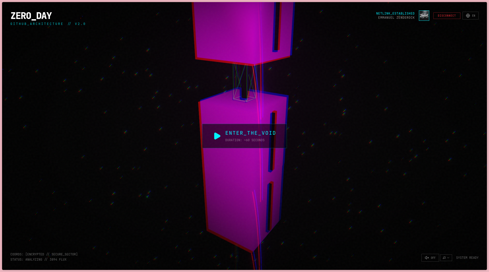

# ZERO_DAY

> **GitHub Wrapped x Cyberpunk Dystopia x Generative Art**



## 🌑 Concept

**ZERO_DAY** transforms your raw development data (commits, PRs, reviews) into an immersive, dark 3D Megastructure. We are breaking away from the cheerful, corporate annual summaries to bring you something visceral.

Your code isn't just stats; it's a structure. A monument.
The application creates a "Spire" where each floor represents a week of your life. The complexity, materials, and stability of the structure are defined by your coding habits.

## ✨ Features

- **The Spire**: Procedural 3D generation based on your GitHub activity.
- **Visuals**: High-fidelity cyberpunk aesthetic with volumetric mood, neon lighting, and CRT effects.
- **Synth-Code**: Procedural audio landscape that evolves with your stats.
- **Story Mode**: An interactive narrative layer analyzing your developer persona.
- **Internationalization**: Fully localized in English and French.

## 🛠️ Tech Stack

- **Core**: [Next.js 14+](https://nextjs.org/) (App Router)
- **3D Engine**: [React Three Fiber](https://docs.pmnd.rs/react-three-fiber) & [Drei](https://github.com/pmndrs/drei)
- **Styling**: [Tailwind CSS](https://tailwindcss.com/)
- **Animation**: [Framer Motion](https://www.framer.com/motion/)
- **Auth**: [NextAuth.js](https://next-auth.js.org/)
- **Data**: GitHub GraphQL API

## 🚀 Getting Started

### Prerequisites

- Node.js 18+
- A GitHub OAuth Application (for authentication)

### Installation

1. **Clone the repository**

   ```bash
   git clone https://github.com/zenderock/zero-day.git
   cd zero-day
   ```

2. **Install dependencies**

   ```bash
   pnpm install
   ```

3. **Environment Setup**
   Create a `.env` file in the root directory:

   ```env
   GITHUB_ID=your_github_client_id
   GITHUB_SECRET=your_github_client_secret
   NEXTAUTH_SECRET=your_generated_secret
   NEXTAUTH_URL=http://localhost:3000
   ```

4. **Run Development Server**

   ```bash
   pnpm  dev
   ```

5. **Enter the Void**
   Open [http://localhost:3000](http://localhost:3000) in your browser.

## 🎨 Credits

Designed and built for those who live in the terminal.

---

> _"The code is the structure. The bugs are the glitches. Welcome to Zero Day."_
